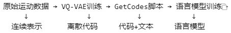

train_t2m_get_codes.py是MotionMillion项目中的数据预处理核心脚本，主要作用是：

1.**将原始运动数据转换为离散代码**：使用训练好的VQ-VAE模型将连续的运动数据编码为离散的token序列

2.**建立运动-文本对应关系**：为每个运动序列生成对应的文本描述和代码序列

3.**计算代码分布概率**：统计所有代码的使用频率，为后续的语言模型训练提供先验知识


#### 代码流程：

##### 模型加载与初始化
```python
    ##### ---- Exp dirs ---- #####
    args = option_trans.get_args_parser()
    torch.manual_seed(args.seed)
    if args.debug:
        args.exp_name = 'debug'
    args.out_dir = os.path.join(args.out_dir, f'{args.exp_name}')

    os.makedirs(args.out_dir, exist_ok = True)

    if args.debug:
        args.print_iter = 1

    # accelerate
    accelerator = Accelerator(mixed_precision=args.mixed_precision, gradient_accumulation_steps=args.gradient_accumulation_steps)
    
    comp_device = accelerator.device

    ##### ---- Logger ---- #####
    logger = utils_model.get_logger(args.out_dir)
    writer = SummaryWriter(args.out_dir)
    logger.info(json.dumps(vars(args), indent=4, sort_keys=True))
    # endregion

    # 打印调试信息
    print("=" * 50)
    print("开始生成运动代码")
    print(f"实验名称: {args.exp_name}")
    print(f"输出目录: {args.out_dir}")
    print(f"设备: {comp_device}")
    print(f"数据集: {args.dataname}")
    print("=" * 50)

    net = vqvae.HumanVQVAE(args, ## use args to define different parameters in different quantizers
                        args.nb_code,
                        args.code_dim,
                        args.output_emb_width,
                        args.down_t,
                        args.stride_t,
                        args.width,
                        args.depth,
                        args.dilation_growth_rate,
                        args.vq_act,
                        args.vq_norm,
                        args.kernel_size,
                        args.use_patcher,
                        args.patch_size,
                        args.patch_method,
                        args.use_attn)

    args.nb_code = net.vqvae.quantizer.codebook_size

    print ('loading checkpoint from {}'.format(args.resume_pth))
    ckpt = torch.load(args.resume_pth, map_location='cpu')['net']
    ckpt = {k.replace('module.', ''): v for k, v in ckpt.items()}
    net.load_state_dict(ckpt, strict=True)
    net.eval()
    net.to(comp_device)
    
    # 打印VQ-VAE模型信息
    print("=" * 50)
    print("VQ-VAE模型加载完毕")
    print(f"Codebook大小: {args.nb_code}")
    print(f"量化器类型: {args.quantizer}")
    print("=" * 50)
```


##### 设置数据集相关的路径配置

- 根目录：./dataset/MotionMillion

- VQ代码目录：./dataset/MotionMillion/VQVAE_codebook_65536_FSQ_all

- 概率文件：./dataset/MotionMillion/VQVAE_codebook_65536_FSQ_all_prob.npy

```python
    if args.dataname == 'motionmillion':
        root_dir = "./dataset/MotionMillion"
        args.vq_dir = os.path.join(root_dir, f'{args.vq_name}')
        args.prob_dir = os.path.join(root_dir, f'{args.vq_name}' + '_prob.npy')
    elif args.dataname == 'kit':
        root_dir = "./dataset/KIT-ML"
        args.vq_dir = os.path.join(root_dir, f'{args.vq_name}')
        args.prob_dir = os.path.join(root_dir, f'{args.vq_name}' + '_prob.npy')
    elif args.dataname == 't2m':
        root_dir = "./dataset/HumanML3D"
        args.vq_dir = os.path.join(root_dir, f'{args.vq_name}')
        args.prob_dir = os.path.join(root_dir, f'{args.vq_name}' + '_prob.npy')
```


##### 生成VQ代码文件准备：

```python
            # 创建数据加载器，用于加载token化的运动数据
            train_loader_token, _, _ = dataset_tokenize.DATALoader(args.dataname, 1, unit_length=2**args.down_t, motion_type=args.motion_type, text_type=args.text_type, version=args.version)
            # 创建VQ代码输出目录
            os.makedirs(args.vq_dir, exist_ok = True)
            
            # 初始化代码计数数组（+2是为了包含特殊token）
            code_counts = torch.zeros(args.nb_code + 2, dtype=torch.long)
            total_tokens = 0  # 总token数量
```


##### 数据加载和处理：

当前循环**只处理运动数据（npy文件）**，生成VQ代码

数据加载：通过 dataset_tokenize.DATALoader 加载运动数据

数据预处理：将运动数据移动到GPU并转换为float类型

VQ编码：使用预训练的VQ-VAE模型将连续的运动数据编码为离散的代码序列

添加结束token：在代码序列末尾添加结束标记（值为 nb_code）

频率统计：统计每个代码在整个数据集中的出现频率(支持一元语法损失)

保存结果：将编码后的代码序列保存为numpy文件

```python
            # 第一个循环：统计每个代码的频率
            for batch in tqdm(train_loader_token):
                pose, name = batch  # pose: 运动数据, name: 文件名
                bs, seq = pose.shape[0], pose.shape[1]  # batch_size, sequence_length
                pose = pose.to(comp_device).float()  # 将数据移动到设备并转换为float类型
                
                # 使用torch.no_grad()禁用梯度计算，节省内存
                with torch.no_grad():
                    # 使用VQ-VAE编码器将运动数据编码为离散代码
                    target = net.encode(pose)
                    # 在代码序列末尾添加结束token（值为nb_code）
                    target_with_end = torch.cat([target, torch.ones(target.shape[0], 1).to(target.device) * args.nb_code], dim=1)
                    # 统计每个代码的出现频率
                    unique_codes, counts = torch.unique(target_with_end, return_counts=True)
                    for code, count in zip(unique_codes, counts):
                        code_counts[code.long()] += count.item()
                    total_tokens += target_with_end.numel()
                    
                    # 保存代码结果到numpy文件
                    target = target.cpu().numpy()  # 转换为numpy数组并移到CPU
                    output_path = pjoin(args.vq_dir, name[0] +'.npy')  # 构建输出文件路径
                    os.makedirs(os.path.dirname(output_path), exist_ok=True)  # 创建目录
                    np.save(output_path, target)  # 保存numpy数组
            
            # 计算每个代码的概率分布（频率除以总token数）
            code_probs = code_counts.float() / total_tokens
            
            # 将概率分布保存到文件
            torch.save(code_probs, args.prob_dir)
            
            logger.info(f"Code distribution saved to {args.prob_dir}")
            print("=" * 50)
            print("运动代码生成完成!")
            print(f"代码分布已保存到: {args.prob_dir}")
            print(f"总token数: {total_tokens}")
            print("=" * 50)
        else:
            # 如果VQ代码和概率文件已存在，跳过生成过程
            if accelerator.is_main_process:
                logger.info(f"The code has been saved in {args.vq_dir} before!")
                print("=" * 50)
                print("运动代码已存在，跳过生成过程")
                print(f"VQ目录: {args.vq_dir}")
                print("=" * 50)
```


##### 将文本数据和VQ代码数据合并到一个pickle文件中：

```python
def merge_into_pickle(root_dir, split_file_path):
    # 读取所有文件名列表
    all_files = open(split_file_path, "r").readlines()
    print(f"开始合并数据，共{len(all_files)}个文件")

    # 创建数据字典结构，用于存储文本数据、代码数据和文件名
    data_dict = {
        "text_data": {},    # 存储每个文件的文本数据
        "code_data": {},    # 存储每个文件的VQ代码数据
        "file_names": []    # 存储所有文件名列表
    }

    # 遍历所有文件，加载文本和代码数据
    for files in tqdm(all_files):
        name = files.strip()  # 去除文件名中的换行符
        data_dict["file_names"].append(name)
        
        # 构建文本文件和代码文件的完整路径
        text_file_path = os.path.join(root_dir, "texts", name + ".txt")
        code_file_path = os.path.join(root_dir, "VQVAE_codebook_65536_FSQ_all", name + ".npy")
        
        # 读取文本数据（每行作为一个元素）
        text_data = open(text_file_path, "r").readlines()
        data_dict["text_data"][name] = text_data  # 存储处理后的文本数据
        
        # 加载VQ代码数据（numpy数组格式）
        code_data = np.load(code_file_path)
        data_dict["code_data"][name] = code_data

    # 将合并后的数据保存为pickle文件
    with open(os.path.join(root_dir, "all_data.pkl"), "wb") as f:
        pickle.dump(data_dict, f)
    
    print(f"数据合并完成，共处理{len(data_dict['file_names'])}个文件")
```


#### 问题：

##### 1：为什么要将连续的运动数据转换为离散代码？——为训练做准备

1. 计算效率：离散代码比连续数据更容易处理，减少了计算复杂度
1. 语言模型兼容：LLaMA等语言模型天然处理离散token，运动代码可以直接作为"词汇"
1. 数据压缩：离散化实现了有效的数据压缩，原始运动数据可能包含冗余信息
1. 泛化能力：离散表示有助于模型学习运动的基本模式和规律

##### 2：VQ-VAE的codebook大小为什么选择65536？

1. 表达能力：65536个代码提供了足够的表达能力来表示复杂的运动模式

1. 内存平衡：既不会因为代码太少而丢失信息，也不会因为太多而增加计算负担

1. 经验选择：这是经过实验验证的最优大小，在表达能力和效率之间取得平衡

1. 与语言模型匹配：这个大小与LLaMA的词汇表大小相匹配，便于模型训练

##### 3：为什么要计算代码的概率分布？

1. 先验知识：概率分布告诉模型哪些运动模式更常见，哪些更罕见

1. 训练稳定性：帮助模型避免生成不常见的运动模式，提高训练稳定性

1. 损失函数优化：可以用于设计更智能的损失函数，对常见模式给予不同权重

1. 数据平衡：帮助识别数据不平衡问题，指导数据增强策略

##### 4：这个预处理步骤在整个pipeline中的位置和作用？



GetCodes脚本的作用：

1. 桥梁作用：连接VQ-VAE和语言模型训练

1. 数据准备：为语言模型提供标准化的训练数据

1. 质量保证：确保所有运动数据都经过统一的编码处理

1. 效率提升：避免在语言模型训练时重复进行VQ-VAE编码

##### 5：为什么使用pickle格式保存最终数据？

1. 完整性：pickle可以保存Python对象的完整结构，包括字典、列表等

1. 效率：二进制格式比文本格式更高效，读写速度更快

1. 一致性：确保数据在保存和加载过程中保持完全一致

1. 便利性：Python原生支持，无需额外的序列化库
