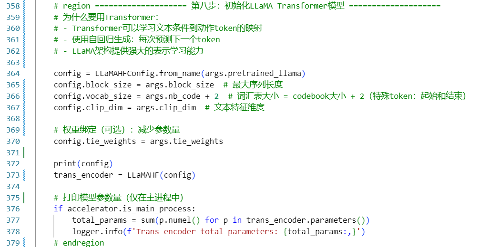
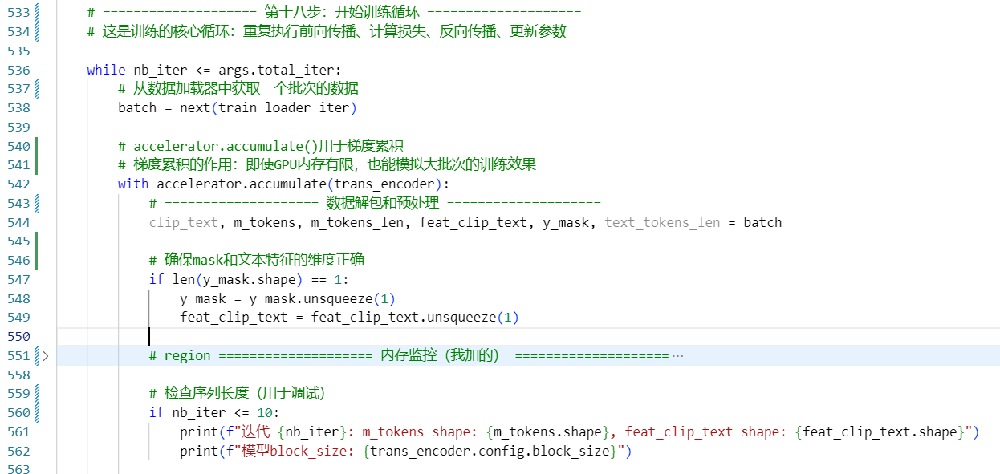

### 主要流程：

#### 准备工作：

前面的步骤可以略过。

##### 初始化文本编码器

将文本描述转换为连续的向量表示
这些向量作为条件输入，指导模型生成对应的动作序列
可以理解为"告诉模型想生成什么样的动作"

##### 初始化VQ-VAE模型

##### 初始化LLaMA Transformer模型

##### 加载预训练的VQ-VAE

##### ...

准备工作依旧掠过

#### 训练流程：

##### 前向传播

文本条件输入：feat_clip_text 嵌入作为条件
动作 token 嵌入：查找 token embedding
位置编码
自注意力/条件生成，对齐文本与动作
预测每个位置的下一个 token（vocab logits）

##### 损失计算

##### 反向传播：

### 问题：

#### 文本序列与动作是怎么对应训练的？

- 采用“多对一”的数据：一个动作有多条描述，逐条利用

- 训练时“随机对齐”：每次随机选择一条描述与该动作配对

- 文本向量化：经 T5 编码后压缩成固定长度向量

- 最终用于模型的条件输入

dataset_TM_train_motionmillion.py脚本中__getitem__的方法：

- 每个epoch从同一条动作的多条描述中随机选择一条

- 增加多样性，降低对单条描述的过拟合

- 动作不变，描述在变化

#### 1：为什么使用Masking策略？能否用Teacher Forcing替代？

- Masking用于正则化，提升鲁棒性。
- Teacher Forcing虽稳定，但在概率上不够准确。
- Masking优势：
  - 可并行训练整个序列；类似BERT的做法；降低对“完整上下文”的依赖。
  - 在本代码中（第166-188行）：
    
- Teacher Forcing在推理时暴露不一致；Masking在训练阶段就引入噪声，适配推理场景。

#### 2：为什么先训练VQ-VAE，再训练Transformer？不能端到端训练吗？

VQ-VAE可预训练并用作分词器，让训练更稳定。端到端可能破坏编解码，且显存压力大。优势是压缩与生成分离；参数规模更可控；更易收敛；能复用VQ-VAE。先训练分词器，再训练语言模型。

#### 3：梯度累积做什么？为什么需要它？

在没有累积时，批次受显存限制，单步梯度更新对应小批次；使用累积可将多步梯度累加，等效大批次，从而稳定训练、提升最终性能。

#### 4：为什么用混合精度训练（fp16/bf16）

混合精度能显著降低显存、加快计算，且通常稳定性可接受。需要留意数值下溢和梯度裁剪，并配合scaler做loss缩放与回退。