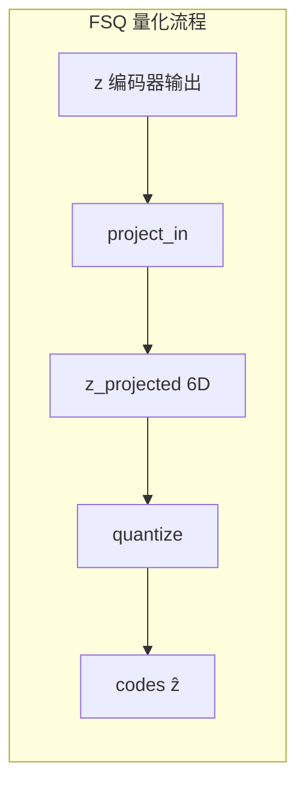
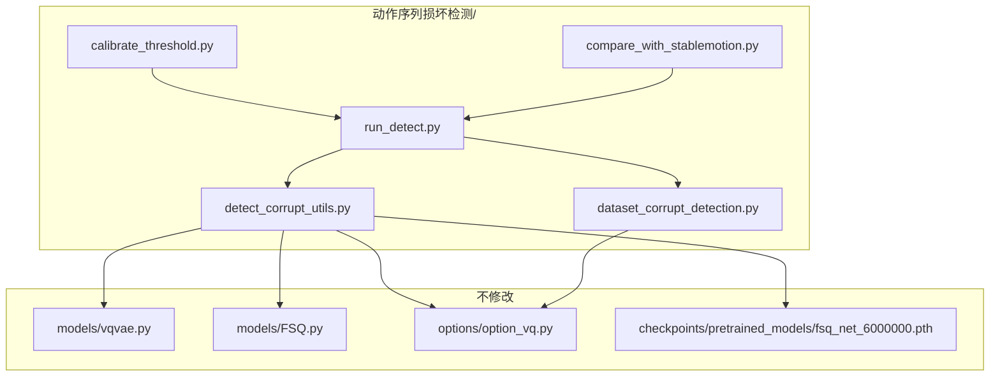
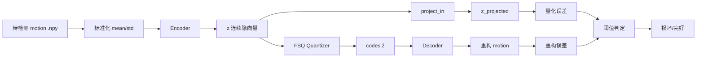
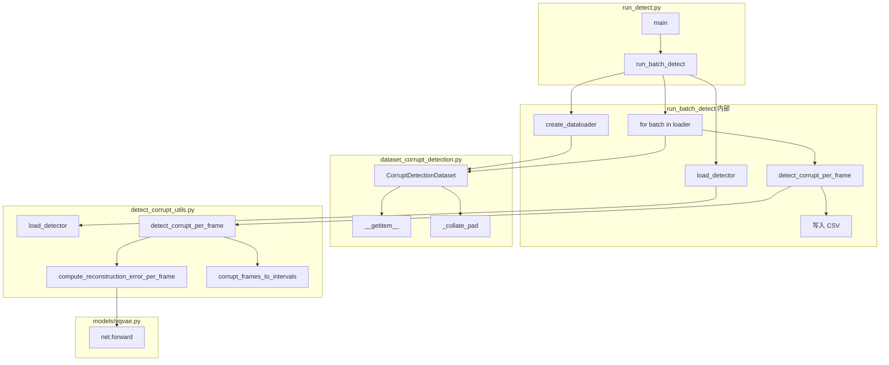

# 基于 MotionMillion FSQ 码本的动作序列损坏检测方案

## 一、技术路线与概念澄清

### 1.1 码本、隐空间与 z、e_k 的关系（纠正理解）

根据你提供的论文公式和 FSQ 实现，需要区分两类量化方式：

**VQ-VAE（论文图）**：`ẑ = Q(z; C) = arg min_{e_k} ||z - e_k||²`


- `z`：编码器输出的**连续**隐向量
- `e_k`：码本 C 中的**离散**码本向量（训练中学习）
- `ẑ`：量化结果，即与 z 最近的 `e_k`
- 量化误差：`||z - e_k||`，越大越异常

**FSQ（本项目实际使用）**：FSQ 没有显式码本表，而是**隐式码本**——由量化等级（如 [8,8,8,5,5,5]）定义的离散格点。




- `z`：编码器输出（连续）
- `z_projected`：投影到有效码本维度（6D）
- `codes`（ẑ）：量化后的离散表示（等价于“最近的格点”）
- **量化误差**：`||z_projected - codes||`，或等价地使用**重构误差** `||decode(encode(motion)) - motion||`

### 1.2 检测原理

- **正常动作**：编码器输出的 z 落在训练数据学到的隐空间格点附近 → 量化误差小
- **损坏动作**：z 偏离格点 → 量化误差大
- **判定**：量化误差（或重构误差）超过阈值 → 判定为损坏

---

## 二、阶段划分与步骤

### 阶段一：环境与依赖准备


| 步骤  | 内容        | 说明                                                                                                   |
| --- | --------- | ---------------------------------------------------------------------------------------------------- |
| 1.1 | 确认预训练模型路径 | 使用 `checkpoints/pretrained_models/fsq_net_6000000.pth`（或你实际路径）                                       |
| 1.2 | 确认数据格式    | MotionMillion：`.npy`，272 维（vector_272），需与 `dataset/MotionMillion/mean_std/vector_272/` 的 mean/std 一致 |
| 1.3 | 创建目录      | 在项目根目录创建 `动作序列损坏检测/`，所有新脚本与计划放于此                                                                     |


### 阶段二：核心检测模块（增量脚本）

**新建脚本**：`动作序列损坏检测/detect_corrupt_utils.py`

**功能**：

- 加载预训练 HumanVQVAE（FSQ），仅用 encoder + quantizer + decoder，**不依赖文本/分词器**
- 提供两种检测指标：
  1. **重构误差**：`L2(rec_motion, motion)`，直接调用现有 `net.forward` 即可
  2. **量化误差**：在有效码本空间计算 `||z_projected - codes||`，需在脚本内复现 FSQ 的 `project_in` + `quantize` 流程（通过访问 `net.vqvae.quantizer` 的 `project_in`、`quantize` 等，不修改原 `models/FSQ.py`）
- 输出：每帧/每段运动的误差标量，以及整体是否损坏的布尔结果（基于阈值）

**设计要点**：

- 通过 `import models.vqvae as vqvae` 和 `option_vq.get_args_parser()` 构建与训练一致的模型
- 使用 `torch.no_grad()`，仅推理
- 支持单条 motion 与 batch

### 阶段三：数据加载适配

**新建脚本**：`动作序列损坏检测/dataset_corrupt_detection.py`

**功能**：

- 复用 `dataset/dataset_VQ.py` 或 `dataset_tokenize.py` 的标准化逻辑（mean/std）
- 支持两种输入：
  1. **目录扫描**：扫描指定目录下 `.npy` 文件
  2. **文件列表**：从 txt 读取文件名列表
- 输出 `DataLoader` 或迭代器，供检测脚本使用
- **不修改** 原有 `dataset/` 下任何文件，仅在本目录内实现

### 阶段四：批量检测脚本

**新建脚本**：`动作序列损坏检测/run_detect.py`

**功能**：

- 命令行入口：`--motion-dir`、`--ckpt`、`--threshold`、`--metric`（recon / quant）、`--output-csv` 等
- 加载 `detect_corrupt_utils` 与 `dataset_corrupt_detection`
- 遍历 motion 文件，计算误差，写入 CSV（文件名、误差值、是否损坏）
- 可选：按帧或按滑动窗口输出细粒度结果

### 阶段五：阈值标定与评估

**新建脚本**：`动作序列损坏检测/calibrate_threshold.py`

**功能**：

- 在**已知完好**与**已知损坏**的样本上运行检测，统计误差分布
- 绘制 ROC 曲线或 Precision-Recall 曲线，辅助选择阈值
- 输出推荐阈值及简单评估指标（AUC、F1 等）

### 阶段六：与 StableMotion 损坏数据对接（可选）

**新建脚本**：`动作序列损坏检测/compare_with_stablemotion.py`

**功能**：

- 读取 StableMotion 的 `labels`（如 `CheckCorruptUtil` 所用格式）
- 将 MotionMillion 检测结果与 StableMotion 标签对比，评估一致性
- 便于后续决定是否用 FSQ 检测替代或补充 StableMotion 的神经网络检测

---

## 三、关键文件与调用关系




---

## 四、数据流示意




---

## 五、实现注意事项

1. **不修改现有脚本**：所有新逻辑放在 `动作序列损坏检测/` 下，通过 `import` 调用现有模块
2. **模型参数一致**：`option_vq` 中 `dataname`、`nb_code`、`quantizer`、`down_t` 等需与训练时一致（如 motionmillion、65536、FSQ、down_t=1）
3. **数据维度**：MotionMillion vector_272 为 272 维；若使用其他 motion 类型需对应调整 mean/std 路径
4. **窗口长度**：训练时 `window_size`、`unit_length` 影响编码长度，检测时需保证输入长度兼容（如 64 帧或 2^down_t 的整数倍）

---

## 六、目录结构（最终）

```
MotionMillion-Codes/
├── 动作序列损坏检测/
│   ├── PLAN.md                    # 本计划（可复制为独立文档）
│   ├── detect_corrupt_utils.py    # 核心检测逻辑
│   ├── dataset_corrupt_detection.py # 数据加载
│   ├── run_detect.py              # 批量检测入口
│   ├── calibrate_threshold.py     # 阈值标定
│   └── compare_with_stablemotion.py # 可选：与 StableMotion 对比
├── models/                        # 不修改
├── checkpoints/
│   └── pretrained_models/
│       └── fsq_net_6000000.pth
└── ...
```

---

## 七、与导师讨论要点

1. **FSQ 与 VQ 的差异**：FSQ 无显式 e_k 表，但 `codes` 等价于“最近格点”，量化误差概念一致
2. **指标选择**：重构误差实现简单、可解释性强；量化误差更贴近理论，两者可同时提供并对比
3. **阈值**：需在标定集上根据业务需求（漏检/误报权衡）确定

---

## 八、检测逻辑详细梳理（调用链与数据流）

### 8.1 总体调用链



### 8.2 数据流：从 .npy 到 corrupt_intervals

| 阶段 | 模块 | 函数/操作 | 输入形状 | 输出形状 | 说明 |
|------|------|-----------|----------|----------|------|
| 1 | dataset_corrupt_detection | `__getitem__` | - | (T, 272), name | 加载 .npy，对齐长度，标准化 |
| 2 | dataset_corrupt_detection | `_collate_pad` | list of (T_i, 272) | (B, T_max, 272) | batch 内 pad 到最大长度 |
| 3 | detect_corrupt_utils | `compute_reconstruction_error_per_frame` | (B, T, 272) | (T,) | 见 8.3 |
| 4 | detect_corrupt_utils | `detect_corrupt_per_frame` | (B, T, 272), threshold | per_frame_err, corrupt_mask, intervals_str | err > threshold 得 mask，转区间 |
| 5 | detect_corrupt_utils | `corrupt_frames_to_intervals` | (T,) bool | "[1,17],[22,78]" | 连续 True 转为 1-based 区间 |

### 8.3 核心：重构误差计算（通俗原理）

**一句话**：把动作序列「压缩-还原」一遍，看还原后和原版差多少；差越多，越像损坏。

**步骤拆解**：

1. **标准化**（dataset_corrupt_detection.py 第 129 行）：

   ```
   motion_norm = (motion - mean) / std
   ```
   - mean、std 来自 `dataset/MotionMillion/mean_std/vector_272/`
   - 与训练时一致，保证输入分布与模型一致

2. **预处理**（models/vqvae.py preprocess）：

   ```
   x_in = motion.permute(0, 2, 1)   # (B, T, 272) -> (B, 272, T)
   ```
   - 编码器期望通道在中间：`(B, C, T)`

3. **编码 → 量化 → 解码**（net.forward）：

   ```
   x_in (B, 272, T) -> Encoder -> z (B, 512, T/2)
   z -> FSQ quantize -> z_quant (B, 512, T/2)
   z_quant -> Decoder -> rec (B, 272, T)
   rec -> postprocess (permute) -> rec (B, T, 272)
   ```
   - down_t=1, stride_t=2，时间维度约减半再恢复
   - 输出 `rec` 与输入 `motion` 形状相同：(B, T, 272)

4. **每帧误差**（detect_corrupt_utils.py 第 261-265 行）：

   ```
   err = MSE(rec, motion, reduction="none")   # (B, T, 272)
   err_per_frame = err.mean(dim=2)            # (B, T)
   ```
   - 公式：对第 t 帧，`err[t] = (1/272) * Σ_d (rec[t,d] - motion[t,d])²`
   - 即每帧 272 维的均方误差

5. **阈值判定**：

   ```
   corrupt_mask[t] = (err_per_frame[t] > threshold)
   ```
   - 误差 > 阈值 → 该帧判为损坏

### 8.4 完整数据流图（含形状）

```mermaid
flowchart LR
    subgraph 输入 [输入]
        npy[.npy 文件]
        npy --> |"np.load"| raw["(T, 272)"]
    end
    
    subgraph 数据加载 [dataset_corrupt_detection]
        raw --> |"对齐 T%unit_length=0"| aligned["(T', 272)"]
        aligned --> |"(x - mean) / std"| norm["(T', 272)"]
        norm --> |"torch.from_numpy"| tensor["Tensor"]
        tensor --> |"collate pad"| batch["(B, T_max, 272)"]
    end
    
    subgraph 检测 [detect_corrupt_utils]
        batch --> |"permute(0,2,1)"| x_in["(B, 272, T)"]
        x_in --> |"Encoder"| z["(B, 512, T/2)"]
        z --> |"FSQ"| zq["(B, 512, T/2)"]
        zq --> |"Decoder"| rec["(B, 272, T)"]
        rec --> |"permute"| rec_out["(B, T, 272)"]
        batch --> |"MSE(rec, motion)"| err["(B, T, 272)"]
        err --> |"mean(dim=2)"| err_frame["(B, T)"]
        err_frame --> |"err > threshold"| mask["(T,) bool"]
        mask --> |"corrupt_frames_to_intervals"| intervals["[1,17],[22,78]"]
    end
```



### 8.5 精确度低的可能原因

结合 GT 与检测结果对比（如 000000：GT [7,40],[115,133] vs 检测 [13,13],[16,16],[18,18],[39,39],[115,220]），可能原因包括：

1. **逐帧独立判定，无时序平滑**
   - 每帧单独与阈值比较，噪声易产生碎片化区间（如 [13,13],[16,16]）
   - 改进：对 `err_per_frame` 做滑动平均或高斯平滑后再阈值

2. **合成损坏与训练分布不完全一致**
   - FSQ 在「正常」动作上训练，合成损坏（jittering、foot sliding 等）的分布可能仍较接近
   - 模型可能部分重建损坏帧，导致误差中等且分散

3. **隐空间时间下采样**
   - 编码器 stride_t=2，latent 时间维度为 T/2，每 token 对应约 2 帧
   - 损坏若只影响单帧，在 latent 中可能被相邻帧稀释

4. **阈值与误差分布**
   - 完好/损坏误差分布重叠大（std 约 0.79），单一阈值难以同时控制误报和漏检

### 8.6 改进方向建议

| 方向 | 做法 |
|------|------|
| 时序平滑 | 对 `err_per_frame` 做 `gaussian_filter1d(sigma=2~3)` 再阈值 |
| 区间合并 | 将间隔小于 N 帧的区间合并，减少碎片 |
| 多尺度 | 同时用整段误差 + 帧级误差，或滑动窗口误差 |
| 后处理 | 过滤掉长度 < L 的短区间，视为噪声 |

