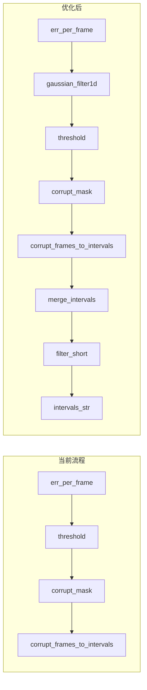

# 动作序列损坏检测精度优化方案

## 一、问题与目标

当前检测存在：

- **碎片化区间**：如 GT [7,40] 被检测为 [13,13],[16,16],[18,18],[39,39]
- **逐帧独立判定**：噪声易产生单帧或极短区间
- **无后处理**：原始 mask 直接转区间，未做时序平滑与区间整理

目标：在保持向后兼容的前提下，引入可配置的优化管线，提升与 GT 的对齐度。

---

## 二、优化管线设计




---

## 三、具体实现

### 3.1 时序平滑（Temporal Smoothing）

**位置**：[detect_corrupt_utils.py](d:\Desktop\动画项目\MotionMillion-Codes\动作序列损坏检测\detect_corrupt_utils.py) 中 `detect_corrupt_per_frame` 函数

**做法**：在阈值判定前，对 `err_per_frame` 做一维高斯平滑，抑制单帧噪声。

- 使用 `scipy.ndimage.gaussian_filter1d`（项目已有 scipy 依赖，见 [generate_corrupt_data.py](d:\Desktop\动画项目\MotionMillion-Codes\动作序列损坏检测\generate_corrupt_data.py) 第 22 行）
- 参数：`sigma=2~3`，`mode='nearest'` 处理边界
- 新增参数：`smooth_sigma: float = 0`，0 表示不平滑（保持原行为）

```python
# 伪代码
if smooth_sigma > 0:
    from scipy.ndimage import gaussian_filter1d
    err_smooth = gaussian_filter1d(per_frame_err.cpu().numpy(), sigma=smooth_sigma, mode='nearest')
    per_frame_err = torch.from_numpy(err_smooth).to(per_frame_err.device)
corrupt_mask = per_frame_err > threshold
```

### 3.2 区间合并（Interval Merging）

**位置**：扩展 [corrupt_frames_to_intervals](d:\Desktop\动画项目\MotionMillion-Codes\动作序列损坏检测\detect_corrupt_utils.py) 或新增 `merge_corrupt_intervals`

**做法**：将间隔小于 N 帧的相邻区间合并为一个大区间，减少碎片。

- 输入：`intervals: List[Tuple[int,int]]`（0-based 或 1-based 需统一）
- 逻辑：若 `intervals[i+1][0] - intervals[i][1] <= merge_gap`，则合并
- 新增参数：`merge_gap: int = 0`，0 表示不合并

**实现策略**：在 `corrupt_frames_to_intervals` 内部，先得到 `intervals` 列表，再按 `merge_gap` 合并，最后格式化为字符串。这样不改变对外返回值格式。

### 3.3 短区间过滤（Post-processing Filter）

**做法**：过滤掉长度小于 L 帧的区间，视为噪声。

- 新增参数：`min_interval_len: int = 0`，0 表示不过滤
- 逻辑：`if (e - s + 1) < min_interval_len: 丢弃`

### 3.4 函数签名与参数传递

修改 `detect_corrupt_per_frame` 签名：

```python
def detect_corrupt_per_frame(
    net, motion, threshold,
    metric: Literal["recon", "quant"] = "recon",
    device: Optional[torch.device] = None,
    smooth_sigma: float = 0,        # 时序平滑 sigma，0=关闭
    merge_gap: int = 0,            # 区间合并：间隔<=此值的区间合并，0=关闭
    min_interval_len: int = 0,     # 短区间过滤：长度<此值的区间丢弃，0=关闭
) -> Tuple[torch.Tensor, torch.Tensor, str]:
```

修改 `corrupt_frames_to_intervals` 签名，增加 `merge_gap` 与 `min_interval_len`，内部实现合并与过滤逻辑。

---

## 四、run_detect.py 集成

在 [run_detect.py](d:\Desktop\动画项目\MotionMillion-Codes\动作序列损坏检测\run_detect.py) 中：

1. 为 `run_batch_detect` 增加参数：`smooth_sigma`、`merge_gap`、`min_interval_len`
2. 增加命令行参数：
  - `--smooth-sigma`（默认 0，推荐 2~3）
  - `--merge-gap`（默认 0，推荐 2~5）
  - `--min-interval-len`（默认 0，推荐 2~4）
3. 调用 `detect_corrupt_per_frame` 时传入上述参数

---

## 五、推荐参数与调参建议


| 参数               | 推荐初值 | 说明                                       |
| ---------------- | ---- | ---------------------------------------- |
| smooth_sigma     | 2.5  | 过大会模糊边界，过小去噪不足                           |
| merge_gap        | 3    | 间隔≤3 帧的区间合并，对应 stride_t=2 的约 1.5 个 token |
| min_interval_len | 2    | 单帧或 2 帧区间多为噪声，可过滤                        |


**调参流程**：在带 GT 的标定集上，对比不同组合的 IoU/Precision/Recall，选择最优组合。可结合 [calibrate_threshold.py](d:\Desktop\动画项目\MotionMillion-Codes\动作序列损坏检测\calibrate_threshold.py)（若存在）做自动化评估。

---

## 六、多尺度检测（可选扩展）

方案 8.6 提到的「多尺度」：同时用整段误差 + 帧级误差。实现方式：

- 若整段 `mean_error > threshold_global`，则整段判为损坏，不再做帧级细化
- 或：帧级检测结果与整段检测做逻辑与/或（如整段正常则清空帧级区间）

此部分可作为后续迭代，本次优先完成时序平滑 + 区间合并 + 短区间过滤。

---

## 七、文件变更清单


| 文件                                                                                              | 变更内容                                                                                                                                          |
| ----------------------------------------------------------------------------------------------- | --------------------------------------------------------------------------------------------------------------------------------------------- |
| [detect_corrupt_utils.py](d:\Desktop\动画项目\MotionMillion-Codes\动作序列损坏检测\detect_corrupt_utils.py) | 1. `corrupt_frames_to_intervals` 增加 `merge_gap`、`min_interval_len`；2. `detect_corrupt_per_frame` 增加 `smooth_sigma` 及平滑逻辑，并调用更新后的 intervals 函数 |
| [run_detect.py](d:\Desktop\动画项目\MotionMillion-Codes\动作序列损坏检测\run_detect.py)                     | 1. `run_batch_detect` 增加 3 个参数；2. 命令行增加 `--smooth-sigma`、`--merge-gap`、`--min-interval-len`；3. 调用时传入                                          |


---

## 八、向后兼容性

- 所有新参数默认值为 0，即不启用任何优化，行为与当前实现完全一致
- 现有调用方（如 `run_detect.py` 未传新参数时）无需修改


优化后反而结果变差了，回撤吧


